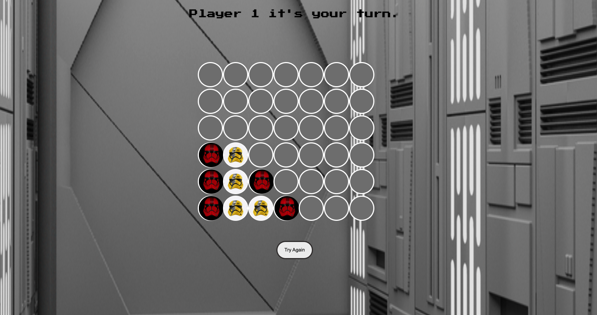

# Connect the Dance Troopers

*Connect the Dance Troopers* is a connect-4 game with a fun stormtrooper theme. The user is first greeted by a start page that disappears after 2 seconds. Player 1 and Player 2 are tasked with getting their assigned stormtrooper themed pieces (red or yellow trooper helmets) to match them 4 in a row either horizontally, vertically, or diagonally. The first player to match 4 pieces in a row wins the round. The winner will be rewarded with a fun pop-up of dancing stormtroopers accompanied by retro synth-wave music. 

## [Play the game here!](https://connect-4-unit-1.netlify.app/)

## Technologies used 🛠️
* 

* 

* 

* 

* 

## Ice Box🧊
- [ ] Work on animating the piece  element so it looks like it’s dropping down the board.
- [ ] Implement AI so player is able to play computer with various  levels of difficulty based on the algorithm.
- [ ] Keep score of wins on a scoreboard.
- [ ] Enable people to log in and play each other remotely.
